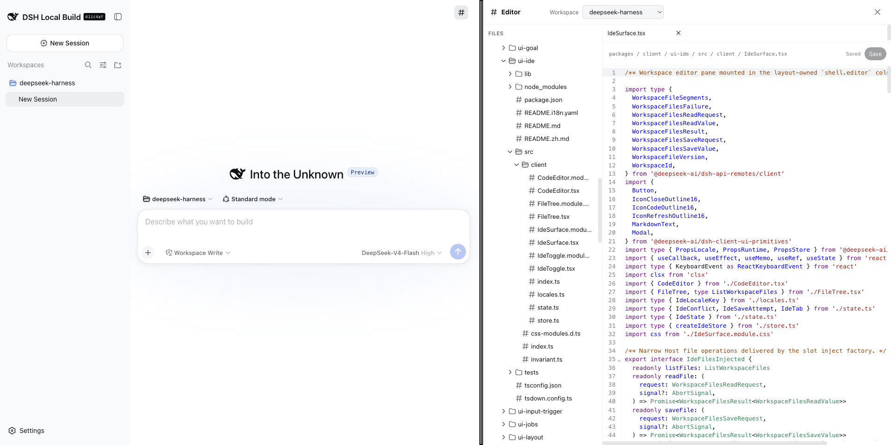

# DeepSeek Harness IDE

English | [中文](README.zh.md)


DeepSeek Harness IDE is an independently maintained community derivative of [DeepSeek Harness](https://github.com/deepseek-ai/deepseek-harness). It adds an integrated Workspace IDE that keeps agent conversations, repository browsing, and file editing in one application.

**Important:** This is not the official DeepSeek Harness repository. The current source is based on upstream [`dsh-v0.1.1-rc.2`](https://github.com/deepseek-ai/deepseek-harness/tree/dsh-v0.1.1-rc.2) and retains its MIT license and attribution.

Upstream DeepSeek Harness is developed by [DeepSeek AI](https://deepseek.com). It uses an architecture where **everything is a plugin** and is powered by [Cordis](https://github.com/cordiverse/cordis), whose design is described in [_A Programming Paradigm for Spatiotemporal Composability_](https://github.com/cordiverse/paper).

## Developer preview

This community derivative is currently a source-only _developer preview_ and is iterating rapidly. **THERE WILL BE COMPATIBILITY-BREAKING CHANGES.**

## What this repository adds

| Capability | Behavior in this repository |
|---|---|
| Workspace IDE | When space permits, a file tree and multi-tab CodeMirror editor share an adjustable split with the agent conversation. At 900px or narrower, the editor takes the content area beside the navigation rail. |
| Agent-to-file navigation | Supported file links from tool cards and produced-file results open a validated text file. An optional line location focuses the requested line. |
| Markdown preview | Markdown tabs preview the current unsaved buffer through the existing sanitized renderer. |
| Conflict-safe saves | Version-checked compare-and-swap saves preserve the local buffer after a concurrent change and display the latest disk content for explicit recovery. There is no unconditional overwrite action. |



The first release edits existing regular UTF-8 files only; it does not create, rename, move, delete, watch, or globally search files. Unsaved buffers are transient and may be lost after a page reload or process crash. See [IDE behavior and limitations](packages/client/ui-ide/README.md) for the complete scope.

<a id="run"></a><a id="run-from-source"></a>

## Run this IDE from source

Install Node.js `^22.19.0` or `>=24.0.0` and enable Corepack, then build this repository and start its `ide` profile:

```sh
git clone https://github.com/NamedVivin/deepseek-harness-ide.git
cd deepseek-harness-ide
corepack enable
pnpm install
pnpm run build
pnpm dsh --profile ide
```

The published `@deepseek-ai/dsh` npm package belongs to the upstream project and does not contain this repository's IDE changes. Configure a supported model and credential after startup as described in the [Web UI guide](docs/user/guide/index.md).

### Desktop packaging

The Electron application source is included and opens no TCP listener. Signed installers are not published; local unsigned packages remain development artifacts. Follow the [desktop application documentation](apps/desktop/README.md) to build them locally.

## Community and support

- Report IDE-specific bugs and suggestions through this repository's [GitHub Issues](https://github.com/NamedVivin/deepseek-harness-ide/issues).
- Use the [upstream Discussions](https://github.com/deepseek-ai/deepseek-harness/discussions) for questions about the official DeepSeek Harness distribution.
- Join the <a href="https://discord.gg/Ycq5dCaS4">upstream DeepSeek Harness Discord community</a>.

## Contributing

See [CONTRIBUTING.md](CONTRIBUTING.md).

## Development

Start with the [development guide](docs/development.md) and [architecture documentation](docs/architecture.md).

For agents, follow [AGENTS.md](AGENTS.md).

## License

[MIT](LICENSE)

Third-party dependencies and their licenses are disclosed in [THIRD_PARTY_NOTICES.md](THIRD_PARTY_NOTICES.md).
